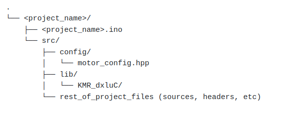

# How to setup
[TOC]

## Installation
1. Follow the installation for the Arduino IDE + Dynamixel2Arduino library + CM9.04 board
2. Specific Arduino file organization

## Use the library in a project

### Specific file organization and library cloning
Due to the file architecture enforced by Arduino, the file organization of your code **must** look like this:


The library needs to be located in ```<project_name>/src/lib/```. <br /> 
You have two possible ways to get the library, either by downloading a copy and simply pasting it there, or by setting it as a git submodule.

In order to have the library as a git submodule:
- when you create a new project: 
```sh
cd <project_name>/src/lib
git submodule add https://github.com/KM-RoBoTa/KMR_dxluC
``` 
- if you want to clone an already existing project with submodules, after cloning the project itself, you need to initialize the submodules:
```sh
git submodule update --init --recursive
``` 
- to update the submodule to its latest commit:
```sh
git submodule update --remote
``` 

The library **needs** the ```<project_name>/src/config/motor_config.hpp``` file. The values inside this file are to be edited by the user, but the names of the variables must not be changed:

```cpp
#ifndef KMR_UC_MOTOR_CONFIG_HPP
#define KMR_UC_MOTOR_CONFIG_HPP

const int nbrMotors = 2;
const int ids[nbrMotors] = {1,2};
const int baudrate = 1000000;
const int protocol_version = 2;

#endif
``` 

The rest of the files can be organized as wished.


### Includes

In the source code, only one header needs to be included (highly recommended to be included by your custom class inheriting ```BaseRobot```):
```cpp
#include "lib/KMR_dxluC/include/KMR_dxluC_robot.hpp"
```

Next: how to [use](use.md)