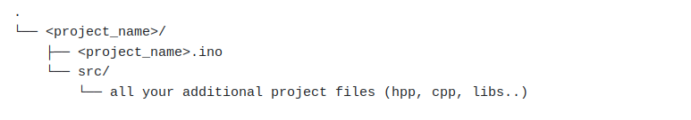

# How to setup
[TOC]

## Installation
Follow ROBOTIS's [installation guide](https://emanual.robotis.com/docs/en/software/arduino_ide/) for using the CM9.04 board in the Arduino IDE, using the Dynamixel2Arduino library.

## Use the library in a project

### Specific file organization and library cloning
Due to the file architecture enforced by Arduino, the file organization of your code **must** look like this:


The folder containing the project needs to be named exactly like the ```.ino``` file. <br /> 
Any additional file to the ```.ino``` file needs to be inside a folder named exactly ```src```, situated in the same folder as the ```.ino```. <br /> 
The rest of the files can be organized as wished.

You have two possible ways to get the library, either by downloading a copy and simply pasting it somewhere inside the ```src``` folder, or by setting it as a git submodule.

In order to have the library as a git submodule:
- when you create a new project: 
```sh
cd <project_name>/src
git submodule add https://github.com/KM-RoBoTa/KMR_dxluC
``` 
- if you want to clone an already existing project with submodules, after cloning the project itself, you need to initialize the submodules:
```sh
git submodule update --init --recursive
``` 
- to update the submodule to its latest commit:
```sh
git submodule update --remote
``` 

### Includes

In the source code, only one header needs to be included (highly recommended to be included by your custom class inheriting ```BaseRobot```):
```cpp
#include "KMR_dxluC/include/KMR_dxluC_robot.hpp"
```

## How to add motor models

Those steps explain how to add a new motor model to the library:
1. In ```config/control_tables.hpp```, create the control tables of that model for both protocols. Add the model numbers to the list of defines on top, for both protocols.
2. In ```include/hal.hpp```, add a new private attribute for that model
3. In ```include/hal.cpp```, in the constructor, initialize the newly created attribute to the correct control table
4. Still in ```include/hal.cpp```, in the method ```getControlTable```, update the switch operator. 

Next: how to [use](use.md)