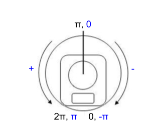
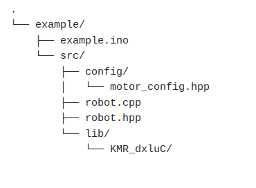

# How to use
[TOC]

As previously mentioned, the library lives in the ```KMR_dxluC``` namespace. 

## Important: motor angle redefinition

The angles of the motors have been redefined in this library so that they feel more natural.  <br /> 
Dynamixel libraries define the motor angles as indicated in black in the following image:



with the angle position being in the interval $]0, 2\pi[$ rad. <br /> 
This library uses the redefined angles as indicated in blue, in the interval  $] - \pi, +\pi[$ rad, with the 0 position being in the center of the motor.


## BaseRobot

The constructor of the library's ```BaseRobot``` class takes the following arguments:
```cpp
/**
 * @brief       Constructor for BaseRobot
 * @param[in]   ids List of IDs of all the motors in the robot
 * @param[in]   nbrMotors Number of motors in the robot
 * @param[in]   baudrate Baudrate of the port handling communication with motors
 * @param[in]   protocol_version Dynamixel protocol version (1 or 2)
 */
BaseRobot::BaseRobot(const int* ids, const int nbrMotors, const int baudrate, const int protocol_version)
```
which means any custom class inheriting ```BaseRobot``` needs to have those arguments as well. 

On construction, it takes care of opening the communication port with the motors, and pings them all. If a motor fails to respond, the program is stopped.

```BaseRobot``` also provides the most commonly used setup functions, such as: 
- enabling and disabling motors with ```enableMotors``` and ```disableMotors```, as well as their id-specific versions
- set minimal and maximal angle limits with ```setMinAngles``` and ```setMaxAngles```
- set minimal and maximal voltage limits with ```setMinVoltages``` and ```setMaxVoltages```
- set the maximum torque with ```setMaxTorques``` (available only in protocol 1)
- set the return times of the motors with ```setReturnTime``` 

> **Reminder** <br> 
> Before writing in the EEPROM memory, the motors need to be disabled.

## Create a custom project-specific Robot class

The project's ```Robot``` class needs to inherit ```KMR_dxluC::BaseRobot```, which results in this class declaration: 

```cpp
// robot.hpp

class Robot : public KMR_dxluC::BaseRobot {
public:
    Robot(const int* ids, const int nbrMotors, const int baudrate, const int protocol_version);

private:

};
```
and this constructor:

```cpp
// robot.cpp

Robot::Robot(const int* ids, const int nbrMotors, const int baudrate, const int protocol_version)
: KMR_dxluC::BaseRobot(ids, nbrMotors, baudrate, protocol_version)
{

}
```

Those arguments are the strict necessity in order to make the library work. Of course, more arguments to ```Robot```'s constructor can be added.

### Writer handlers

To create a handler that sends data to the motors (example: goal positions, LED control), you need to use a  ```KMR_dxluC::Writer``` object. 
It can be declared as a private member of ```Robot``` (let's take the example of wanting to write goal positions):

```cpp
// robot.hpp

class Robot : public KMR_dxluC::BaseRobot {
public:
    Robot(const int* ids, const int nbrMotors, const int baudrate, const int protocol_version);

private:
    KMR_dxluC::Writer *positionWriter;
};
```

and then initialized in Robot's constructor. A ```Writer``` constructor takes the following arguments:
```cpp
/**
 * @brief       Constructor for a Writer handler, used for writing data to motors
 * @param[in]   ids List of IDs of the motors handled by this specific handler
 * @param[in]   nbrMotors Number of motors handled by this handler 
 * @param[in]   item Control field written to by this handler
 * @param[in]   hal Pointer to the previously created Hal object
 * @param[in]   dxl Pointer to the previously created Dynamixel2Arduino object
 */
Writer::Writer(const int* ids, const int nbrMotors, ControlTableItem::ControlTableItemIndex item, Hal* hal, Dynamixel2Arduino* dxl)
```

The control item is the field to which the ```Writer``` object writes. Those fields are defined in the Dynamixel2Arduino library's ```actuator.h``` header file. 
For example, for position writing, the field is ```ControlTableItem::GOAL_POSITION ```. Check the aforementioned header file or the Dynamixel SDK's documentation for the exhaustive list of fields.

The constructor's arguments "hal" and "dxl" are *always* "m_hal" and "m_dxl", which are attributes of ```BaseRobot``` (there's no need to concern yourself with those more).

All of this results in the following initialization of a ```Writer``` object handling goal positions in ```Robot```'s constructor:

```cpp
// robot.cpp

Robot::Robot(const int* ids, const int nbrMotors, const int baudrate, const int protocol_version)
: KMR_dxluC::BaseRobot(ids, nbrMotors, baudrate, protocol_version)
{
    positionWriter = new KMR_dxluC::Writer(ids, nbrMotors, ControlTableItem::GOAL_POSITION, m_hal, m_dxl);
}
```

Finally, the last element we need to use the ```Writer``` is the function that actually sends the data to motors. The creation of this function is very straightforward: a ```Writer``` object has the method ```write``` that takes care of taking the input values (expressed in SI units), transforming them and sending them to the motors. <br /> 
You can create a public method in ```Robot``` that will take care of it:
```cpp
// robot.hpp

class Robot : public KMR_dxluC::BaseRobot {
public:
    Robot(const int* ids, const int nbrMotors, const int baudrate, const int protocol_version);
    void setPositions(float* positions);

private:
    KMR_dxluC::Writer *positionWriter;
};
```

with the method itself being:
```cpp
// robot.cpp

/**
 * @brief       Send input positions to the motors
 * @param[in]   positions Goal positions to be sent to motors [rad]
 */
void Robot::setPositions(float* positions)
{
    positionWriter->write(positions);
}
```

As a summary, after creating those functions and objects, you only need to call ```Robot```'s method ```setPositions```, taking the array of goal positions expressed in radians as the input.

> **Note** <br> 
> ```Writer``` objects use Dynamixel's ```syncWrite``` function 

### Reader handlers

In order to fetch data from the motors' sensors (for example current position and temperature), a ```KMR_dxluC::Reader``` object is required. It works extremely similarly to its ```Writer``` counterpart.

A ```Reader```'s constructor takes the exact same arguments as a ```Writer```, with the "item" being the control field the ```Reader``` will be reading from. <br /> 
The method used to actually read the values is ```read```, giving, for example in the case of getting the current motor position:

```cpp
// robot.hpp

class Robot : public KMR_dxluC::BaseRobot {
public:
    Robot(const int* ids, const int nbrMotors, const int baudrate, const int protocol_version);
    void getPositions(float* positions);

private:
    KMR_dxluC::Reader *positionReader;
};
```

```cpp
// robot.cpp

Robot::Robot(const int* ids, const int nbrMotors, const int baudrate, const int protocol_version)
: KMR_dxluC::BaseRobot(ids, nbrMotors, baudrate, protocol_version)
{
    positionReader = new KMR_dxluC::Reader(ids, nbrMotors, ControlTableItem::PRESENT_POSITION, m_hal, m_dxl);
}

/**
 * @brief       Read the motors' current positions 
 * @param[out]  positions Current positions received from the motors [rad]
 */
void Robot::getPositions(float* positions)
{
    positionReader->read(positions);
}
```

> **Note** <br> 
> ```Reader``` objects use Dynamixel's ```bulkWrite``` function when in protocol 2, and the normal ```write``` function in protocol 1. 
> This results in reading being much faster in protocol 2. Nevertheless, it still remains very slow in any case.

## Example code
A full working example code can be found in the ```example``` folder.

In that example, we have 2 motors, using protocol 2. <br /> 
We want to constraint their allowed angle ranges between a minimum and maximum angle. <br /> 
In the main loop, the motors' positions are going to constantly oscillate between that minimum and maximum value.<br /> 
When the motors are going forward (positive rotation), we want their LED to be on.<br /> 
We also want to read their current position at every step.

This results in needing a total of 3 handlers:
- a ```Writer``` that takes care of writing the goal positions
- a ```Writer``` that takes care of writing the LED command
- a ```Reader``` that takes care of reading the current position

The minimum and maximum angle limits are sent as an additional argument in ```Robot'```s constructor, where we use the ```KMR_dlxUC::BaseRobot```'s predefined functions to set those limits.

The complete code can be found in INSERT LINK TO EXAMPLE REPO.
The example's files are organized as follows:

